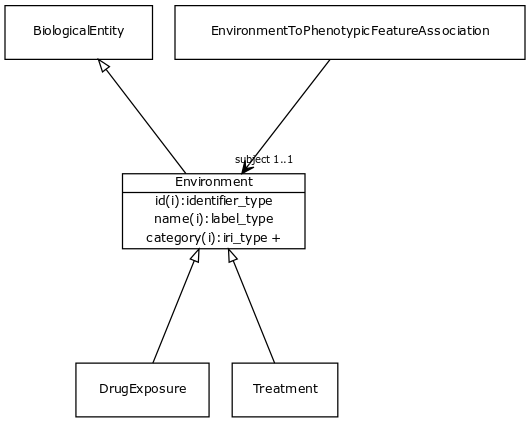

# Class: environment

A feature of the environment of an organism that influences one or more phenotypic features of that organism, potentially mediated by genes

URI: [biolink:Environment](https://w3id.org/biolink/vocab/Environment)

## Parents

 *  is_a: [BiologicalEntity](BiologicalEntity.md)

## Children

 * [DrugExposure](DrugExposure.md) - A drug exposure is an intake of a particular chemical substance
 * [Treatment](Treatment.md) - A treatment is targeted at a disease or phenotype and may involve multiple drug 'exposures'

## Referenced by class

 *  **[EnvironmentToPhenotypicFeatureAssociation](EnvironmentToPhenotypicFeatureAssociation.md)** *[subject](environment_to_phenotypic_feature_association_subject.md)*  REQ  **[Environment](Environment.md)**

## Attributes

### Inherited from named thing:

 * [id](id.md)  REQ
    * Description: A unique identifier for a thing. Must be either a CURIE shorthand for a URI or a complete URI
    * range: [IdentifierType](IdentifierType.md)
    * inherited from: [NamedThing](NamedThing.md)
    * in subsets: (translator_minimal)
 * [name](name.md)  REQ
    * Description: A human-readable name for a thing
    * range: [LabelType](LabelType.md)
    * inherited from: [NamedThing](NamedThing.md)
    * in subsets: (translator_minimal)
 * [category](category.md)  1..*
    * Description: Name of the high level ontology class in which this entity is categorized. Corresponds to the label for the biolink entity type class. In a neo4j database this MAY correspond to the neo4j label tag
    * range: [IriType](IriType.md)
    * inherited from: [NamedThing](NamedThing.md)
    * in subsets: (translator_minimal)
